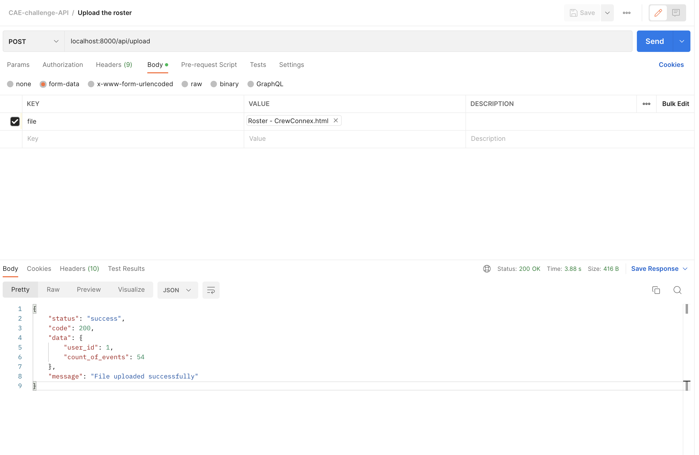

#CAE Solution for parsing the roster and providing API endpoints

## Postman Collection will be available here [collection](CAE-postman_collection.json)

## Steps followed 

* Separate Controller classes are create to serve different endpoint[Controller](app/Http/Controllers/)
* added the post and get routes in [routes/api.php](routes/api.php)
* Defined **Migrations**[database/migrations](database/migrations) and eloquent models [app/Models](app/Models)
* Created Resources classes to map the DB entries to API response [app/Http/Resources](app/Http/Resources)
* Added swagger docs and installed library [darkaonline/l5-swagger](https://github.com/DarkaOnLine/L5-Swagger) for swagger generation for laravel. **Swagger specs can be seen here** [storage/api-docs/api-docs.json](storage/api-docs/api-docs.json) 
* Service classes are written to keep the business logic away from controller
* Parsers are written in a separate folder. 
* Logging service for each and every api request is written here [app/Services/LoggerService.php](app/Services/LoggerService.php). This is done through middleware [app/Http/Middleware/ApiLoggerMiddleware.php](app/Http/Middleware/ApiLoggerMiddleware.php)

## Assumptions

* HTML files are used for valid workflow
* HTML files will be used in the same format as here [tests/Feature/schedule.html](tests/Feature/schedule.html)
* Using other files will throw error. But provision for incorporating new parsers are already there. You can inject different parsers based on the file extension. That way, the code will become easily extendible.
* OFF events are mapped as DO
* CAR events are mapped as UNK
* **Checkin and Checkout events are processed as separate entities.** So For example, for 'Mon 15', you have four rows (first row has checkin and last row has checkout information). Now while parsing, I broke this into a total of 6 events;one CI event, four flights, one CO event. This will be listed in this order in the API responses as well.
* All the other fields which are not mentioned in the assignments (till ACReg) are simply saved as-is(except the date, which is saved as date format).

## Tests

* Integration tests are written for every controller.
* This internally covers all the lines of the underlying service classes
* Hence, only one unit test is written just to demonstrate. That can be viewed here [tests/Unit/Services/Parser/HtmlParserTest.php](tests/Unit/Services/Parser/HtmlParserTest.php)
* I achieved **100 %** code coverage. It can be checked here [coverage-report/index.html](coverage-report/index.html) (Usually will be ignored in git. But added intentionally here to get a quick glance on what I've achieved)
* Used a different test database(sqlite) here so that I can divert all the testing db calls to that one. This will help in avoiding the mockery of the DB calls. `<env name="DB_DATABASE" value="testing.sqlite" />` has been set to achieve it.

## Docker environment

Docker environment is setup and it makes it easy to run the solution without much hassle. the command `sh start.sh` would get the app ready. Assuming that you have php locally installed on your local(because I'm running this command under the hood 'php artisan migrate --force'. If we need to this via docker, we should run `docker exec <container-id> php artisan migrate`. Both approaches can be done, but the latter needs to be done separately after the start.sh command). I've used port 8000 here[docker-compose.yaml](docker-compose.yaml). So in local, you will be able to see the app running here **localhost:8000**. I have used nginx and php-fpm(all latest versions).

## Commands used

* **For running tests** I used `docker exec <container-id> php artisan test --coverage-html=coverage-report `. This would give the code coverage report as well in the directory [coverage-report/](coverage-report/)
* **For running swagger generation**, I used `docker exec <container-id>  php artisan l5-swagger:generate`. this will generate the swagger spec here [storage/api-docs/api-docs.json](storage/api-docs/api-docs.json)
* To start migration by creating table definition, I used `docker exec <container-id> php artisan make:migration create_events_table`
* To run the migration, I used `docker exec <container-id> php artisan migrate`
* To make models, I used `docker exec <container-id> php artisan make:model Events`

## Screenshots

### Code coverage

### APIs

### SQLite

